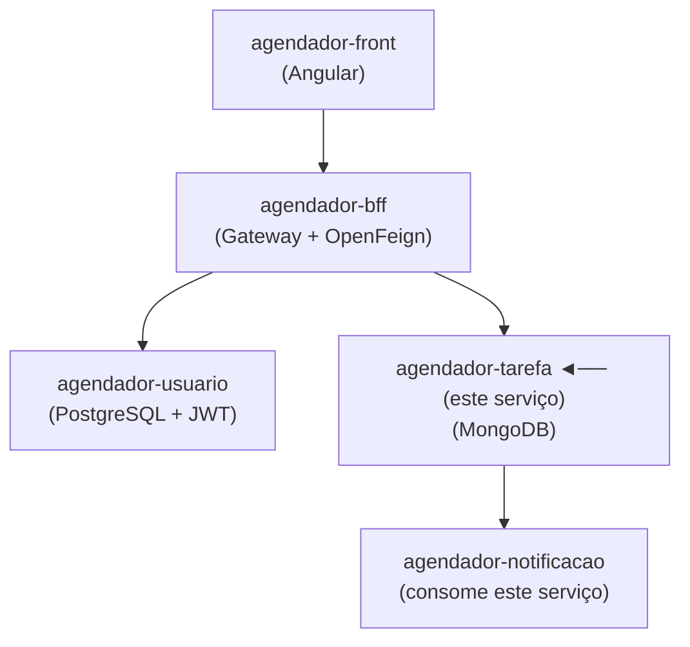

# 📋 Agendador — Serviço de Tarefas

> Microsserviço responsável pelo gerenciamento de tarefas/agendas, com persistência em MongoDB e validação de identidade via integração com o serviço de usuários.

---

## 📌 Sobre o Projeto

Serviço core do ecossistema de agendamento. Gerencia o ciclo de vida das tarefas dos usuários — criação, leitura, atualização e exclusão — validando o token JWT em cada requisição para garantir que apenas usuários autenticados operem sobre seus dados.

---

## 🏗️ Arquitetura do Ecossistema



---

## 🚀 Tecnologias

| Tecnologia | Finalidade |
|---|---|
| Java / Spring Boot | Base do microsserviço |
| MongoDB | Persistência de tarefas |
| Spring Data MongoDB | Abstração de acesso ao MongoDB |
| Spring Web | Exposição de endpoints REST |
| RestTemplate / Feign | Comunicação com `agendador-usuario` |

---

## ⚙️ Funcionalidades

- [x] CRUD completo de tarefas
- [x] Validação de token JWT via integração com `agendador-usuario`
- [x] Tarefas associadas ao usuário autenticado
- [x] Exposição de endpoint consumido pelo `agendador-notificacao` para tarefas próximas do vencimento

---

## 🔐 Endpoints Principais

| Método | Rota | Descrição |
|---|---|---|
| `POST` | `/tarefas` | Criar nova tarefa |
| `GET` | `/tarefas` | Listar tarefas do usuário autenticado |
| `GET` | `/tarefas/{id}` | Buscar tarefa por ID |
| `PUT` | `/tarefas/{id}` | Atualizar tarefa |
| `DELETE` | `/tarefas/{id}` | Remover tarefa |
| `GET` | `/tarefas/proximas` | Tarefas com vencimento ≤ 1h (uso interno) |

> ⚠️ Todas as rotas exigem token JWT válido no header `Authorization: Bearer {token}`

---

## 🔧 Como Executar

### Pré-requisitos
- Java 25
- MongoDB rodando localmente
- Serviço `agendador-usuario` em execução

### Variáveis de Ambiente

```properties
MONGODB_URI=mongodb://localhost:27017/agendador_tarefas
USUARIO_SERVICE_URL=http://localhost:8081
```

### Rodando a aplicação

```bash
./mvnw spring-boot:run
```

---

## 📂 Outros Serviços do Ecossistema

| Serviço | Descrição |
|---|---|
| [agendador-usuario](../agendador-usuario) | CRUD de usuários com autenticação JWT |
| [agendador-notificacao](../agendador-notificacao) | Notificações por e-mail via Gmail API |
| [agendador-bff](../agendador-bff) | Gateway e documentação Swagger |
| [agendador-front](../agendador-front) | Interface Angular |

---
